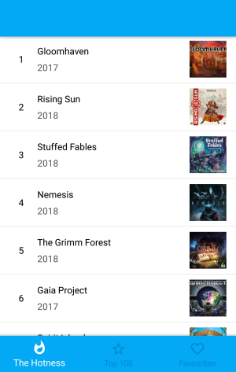
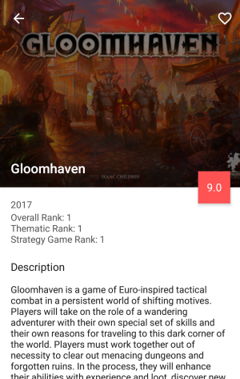
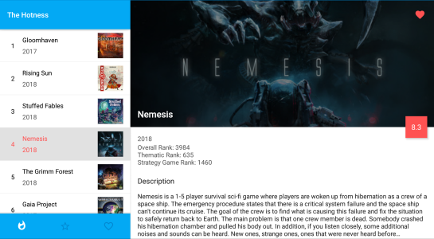

# BGDb

BGDb is an Android app that provides an easy, mobile-friendly way to view top board games and save favourites using BoardGameGeek's API.

This was created as the final project of the Android Developer Nanodegree course.

## Project Details

- Created XML layout files and fragments to enable single pane for phones and dual pane for tablets.
- Added BottomNavigationView for easy navigation on the main screen.
- Created custom BottomNavigationView for tablet layout to remove text label from below icon. Label is displayed in the app bar instead.
- Implemented database contract, ContentProvider, and Loaders to store and update favourites.
- Added CollapsingToolbarLayout to detail screen to display board game image and title.

## Example Usage

The main screen displays a list of board games with a bottom navigation bar below it.

Tapping a board game in the list opens the details screen where users can add the game to their favourites by tapping on the heart in the action bar.

A dual pane layout is used on tablets.

## License

This project is licensed under the MIT License - see the [LICENSE.md](LICENSE.md) file for details.